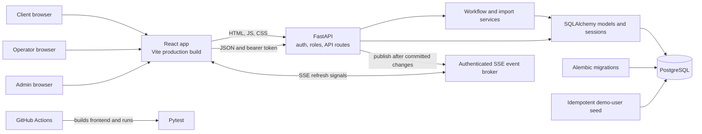
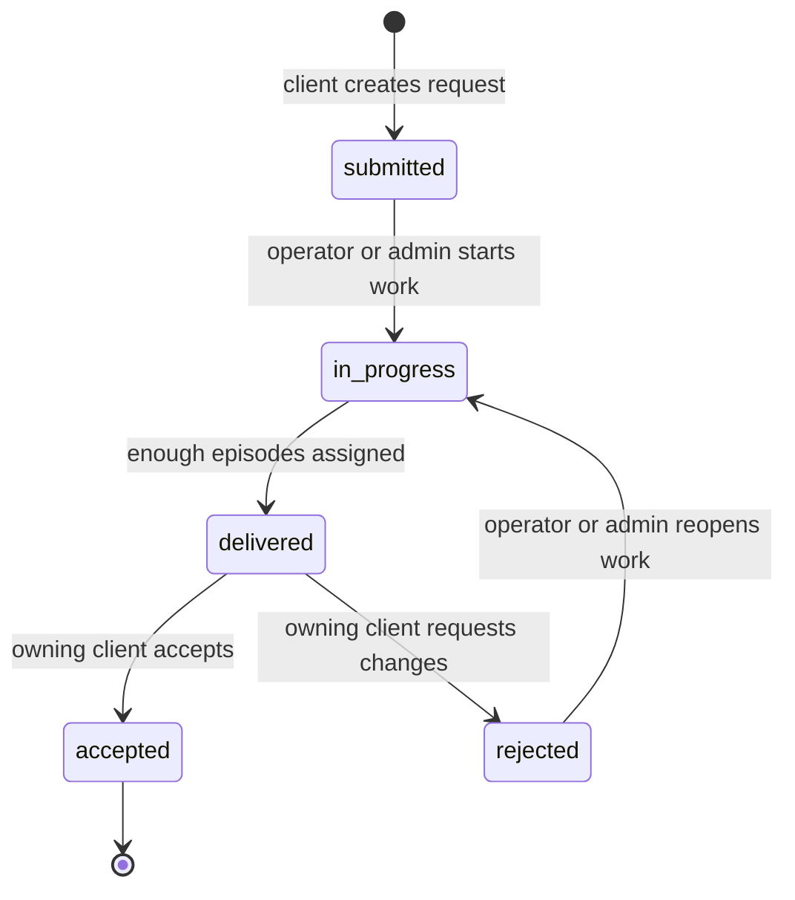

# Dataset Request Desk

Dataset Request Desk coordinates robotics dataset requests from submission through delivery. Clients describe the task and number of episodes they need. Operators find and assign suitable recordings, then deliver the completed request. Clients can accept the delivery or reject it for rework.

The project includes a React browser app, a FastAPI JSON API, PostgreSQL persistence, role-based access, CSV episode import, analytics, and live updates. The browser app and API are served from the same origin.

## Contents

- [System architecture](#system-architecture)
- [How the workflows work](#how-the-workflows-work)
- [Live updates](#live-updates)
- [Run the whole app](#run-the-whole-app)
- [Demo accounts](#demo-accounts)
- [API guide](#api-guide)
- [Episode CSV import](#episode-csv-import)
- [Tests and CI](#tests-and-ci)
- [Repository layout](#repository-layout)

## System architecture



### Main parts

| Part | Responsibility |
| --- | --- |
| React UI (`frontend/`) | Role-specific client, operator, and admin workspaces. Vite compiles it into static production files. |
| FastAPI (`backend/app/api/`) | Serves the React app and provides authenticated JSON endpoints for requests, users, episodes, analytics, and events. |
| Authentication and authorization | Login issues a signed bearer token. The API looks up the active user and checks permissions on each protected operation. UI route checks help navigation, but API checks are the security boundary. |
| Services (`backend/app/services/`) | Enforce status transitions and episode assignment rules, import CSV rows, and broadcast live refresh signals. |
| SQLAlchemy and PostgreSQL | Store accounts, requests, request history, episodes, and assignments. Alembic applies schema changes. |
| Docker Compose | Runs PostgreSQL and the API/UI together. The API image builds React in a Node stage, then packages the static build with FastAPI in a Python image. |
| GitHub Actions | Builds the frontend and runs backend tests for pushes and pull requests. |

Inside Compose, the API reaches the database at `db:5432`. The database is also exposed to the host at `localhost:5433`; the web app is exposed at `localhost:8000`.

## How the workflows work

### Roles and screens

| Role | Workspace | Main actions |
| --- | --- | --- |
| Client | `/client` | Create requests, see only their own requests and statuses, accept a delivered request, or reject it for rework. |
| Operator | `/operator/requests`, `/operator/episodes`, `/operator/analytics` | View the shared queue, move work forward, filter and assign episodes, import CSV data, and review analytics. |
| Admin | `/admin/users`, `/admin/requests`, `/admin/episodes`, `/admin/analytics` | Use the operations screens and manage user accounts. Admin navigation stays within the admin workspace. |

The API enforces access even if someone manually enters another role's URL. Operators and admins can access operations endpoints; user management is admin-only. Clients can only read or change their own requests.

### Request lifecycle



The server validates every transition. A request cannot be marked `delivered` until at least `episodes_requested` episodes have been assigned. Each successful status change is recorded in `request_status_history`, including the previous and new statuses, actor, timestamp, and optional note. `accepted` is terminal.

### Episode assignment

Operators and admins can search the episode catalog by partial task name and quality. Only unassigned episodes are shown by default. Episodes with `good` or `usable` quality can be assigned; `bad` quality recordings cannot. A database uniqueness constraint prevents one episode being assigned more than once, including if two operators attempt it at the same time. The UI takes a request ID to make assignment straightforward.

### Client delivery response

When a request is delivered, its owner sees **Accept delivery** and **Request changes** actions. Accepting completes the workflow. Rejecting moves the request to `rejected`; an operator or admin can reopen it to `in_progress` and continue work.

## Live updates

The app uses **Server-Sent Events (SSE)**, not WebSockets. Each signed-in browser opens an authenticated `GET /events` stream using its bearer token in the `Authorization` header. The stream sends small invalidation messages rather than request or user details. The UI then calls its normal role-authorized API route to reload current data.

| Event | Published after | Screens refreshed |
| --- | --- | --- |
| `requests_changed` | Request creation, a status transition, or episode assignment | Client request lists and operator/admin request queues |
| `episodes_changed` | CSV import or episode assignment | Operator/admin episode availability and analytics |

The browser reconnects if the stream drops and refreshes its view after reconnecting. The server sends periodic keepalives so idle connections remain open. This lightweight broker is held in API process memory, which matches the single API container in the provided Compose setup. If the API is later run as multiple workers or replicas, use a shared message broker so an event from one process can reach browsers connected to another.

## Run the whole app

Install Docker Desktop (including Docker Compose), clone the repository, open a terminal in its root, and run:

```sh
docker compose up --build
```

That single command builds the React production assets and API image, starts PostgreSQL, waits for its health check, applies Alembic migrations, adds any missing demo users, and starts FastAPI serving both the UI and API.

Open:

- App: [http://localhost:8000](http://localhost:8000)
- API documentation: [http://localhost:8000/docs](http://localhost:8000/docs)
- Health check: [http://localhost:8000/health](http://localhost:8000/health)

Stop the stack with **Ctrl+C**. To stop and remove containers while keeping database data, run:

```sh
docker compose down
```

PostgreSQL data lives in the named `postgres_data` volume and remains across normal restarts. **This deletes the local database and its data**:

```sh
docker compose down -v
```

The Compose fallback `SECRET_KEY` and seeded accounts are for local evaluation only. For a private local key, copy `.env.example` to `.env` and set `SECRET_KEY`. Do not use the development key or demo credentials for a public deployment. The Compose file overrides the example database URL with the internal `db:5432` address.

## Demo accounts

The seed script reads [`backend/seed/users.json`](backend/seed/users.json). On startup it creates accounts that do not already exist; it deliberately does not reset the names, roles, passwords, or active flags of existing users.

| Role | Email | Password |
| --- | --- | --- |
| Admin | `admin@example.com` | `admin123` |
| Operator | `ops1@example.com` | `ops123` |
| Operator | `ops2@example.com` | `ops123` |
| Client | `client-a@example.com` | `client123` |
| Client | `client-b@example.com` | `client123` |

These credentials are for local development and evaluation only.

## API guide

Protected routes require `Authorization: Bearer <access_token>`. Obtain a token by sending the login form fields `username` (the account email) and `password` to `POST /auth/login`. The API returns `access_token` and `token_type`. `GET /auth/me` returns the current active account.

Example login with `curl`:

```sh
curl -X POST http://localhost:8000/auth/login \
  -H "Content-Type: application/x-www-form-urlencoded" \
  -d "username=client-a@example.com&password=client123"
```

| Method | Route | Access | Purpose |
| --- | --- | --- | --- |
| `POST` | `/auth/login` | Public | Exchange email/password for a bearer token. |
| `GET` | `/auth/me` | Signed in | Get the current account. |
| `POST` | `/requests` | Client, admin | Create a request. The client owner comes from the signed-in account. |
| `GET` | `/requests` | Signed in | List requests; clients receive only their own, operations roles receive the queue. Supports `limit` and `offset`. |
| `GET` | `/requests/{id}` | Signed in | Read request detail, with client ownership enforced. |
| `GET` | `/requests/{id}/history` | Signed in | Read status history, with client ownership enforced. |
| `PATCH` | `/requests/{id}/status` | Signed in | Request a workflow transition; the service checks role, ownership, transition, and delivery quantity. |
| `GET` | `/episodes` | Operator, admin | Search episodes with `task_name`, `quality`, `available_only`, `limit`, and `offset`. |
| `POST` | `/episodes/import` | Operator, admin | Upload an episode CSV as multipart field `file`. |
| `POST` | `/episodes/requests/{request_id}/assignments` | Operator, admin | Assign an episode using JSON body `{"episode_id": 123}` (database episode ID). |
| `GET` | `/episodes/requests/{request_id}/assignments` | Signed in | List a request's episodes; clients can access only their own request. |
| `GET` | `/analytics` | Operator, admin | Query aggregates using `start_date` and `end_date`; optional `robot_id`, `limit`, and `offset`. |
| `GET` | `/users` | Admin | List accounts. |
| `POST` | `/users` | Admin | Create an account with email, name, role, password, and optional organisation. |
| `PATCH` | `/users/{id}/role` | Admin | Change an account role. |
| `PATCH` | `/users/{id}/active?active=true\|false` | Admin | Activate or deactivate an account; an admin cannot deactivate their own account. |
| `GET` | `/events` | Signed in | Open the authenticated SSE live-update stream. |
| `GET` | `/health` | Public | Check API health. |

Request statuses are `submitted`, `in_progress`, `delivered`, `accepted`, and `rejected`. Episode qualities are `good`, `usable`, and `bad`. API request and response schemas are also available in Swagger at `/docs`.

## Episode CSV import

The sample file is [`backend/seed/episodes.csv`](backend/seed/episodes.csv). Startup seeds users, but does **not** automatically import episode rows. An operator or admin can use **Import CSV** in the Episodes screen or upload the file directly. Required columns are:

```csv
episode_id,robot_id,task_name,recorded_at,duration_seconds,operator_name,quality
```

`episode_id`, `robot_id`, `task_name`, `recorded_at`, `duration_seconds`, and `quality` are required. Timestamps are normalized to UTC; robot IDs and quality casing are normalized; whitespace in task names is cleaned. The import report includes row numbers and reasons for skipped rows. Existing episode IDs are skipped, so repeating an import does not duplicate episodes. Valid rows can still be imported when other rows in the same CSV are invalid.

## Analytics

Operators and admins can view analytics in their workspace or call `GET /analytics?start_date=YYYY-MM-DD&end_date=YYYY-MM-DD`. The end date is inclusive. An optional `robot_id` narrows episode grouping. Results include:

- Episode counts grouped by recording date and robot, with `limit`/`offset` pagination.
- Request counts grouped by current status for requests created in the selected range.
- Median time between a request's first submitted history event and its first delivered history event.
- The five task names with the most good-quality episodes during the selected range.

Aggregations are calculated in the database. PostgreSQL uses `percentile_cont` for the median; SQLite uses window functions so the same endpoint logic can be used in CI.

## Tests and CI

Run the backend suite in the running API container:

```sh
docker compose exec api python -m pytest -q
```

Or, with the Python dependencies installed locally, from the repository root:

```sh
python -m pytest backend/tests -q
```

The suite focuses on password hashing, role authorization, ownership and request status transitions, the minimum episode count before delivery, episode quality and duplicate assignment rules, and repeat CSV import behavior. It does not target a coverage percentage.

The workflow at [`.github/workflows/ci.yml`](.github/workflows/ci.yml) runs on pushes and pull requests. It builds the frontend with Node.js 24, installs the Python dependencies, then runs the backend suite with SQLite and a CI-only signing key.

## Repository layout

| Path | Contents |
| --- | --- |
| `frontend/src/` | React application and styles. |
| `frontend/package.json` | Frontend dependencies and Vite build command. |
| `backend/app/api/` | FastAPI endpoints, including authentication and SSE. |
| `backend/app/core/` | Configuration and security helpers. |
| `backend/app/models/` | SQLAlchemy database models and relationships. |
| `backend/app/schemas/` | Pydantic request and response schemas. |
| `backend/app/services/` | Status workflow, assignments, imports, and live event broker. |
| `backend/alembic/` | Database migration environment and version history. |
| `backend/seed/` | Demo user seed script, demo accounts, sample episode CSV, and CSV generator. |
| `backend/tests/` | Backend authorization, workflow, assignment, security, and import tests. |
| `Dockerfile` | Multi-stage React build and Python runtime image. |
| `docker-compose.yml` | PostgreSQL and API/UI services, startup migration, and user seeding. |
| `.github/workflows/ci.yml` | Frontend build and backend CI workflow. |
